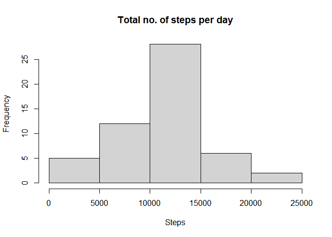
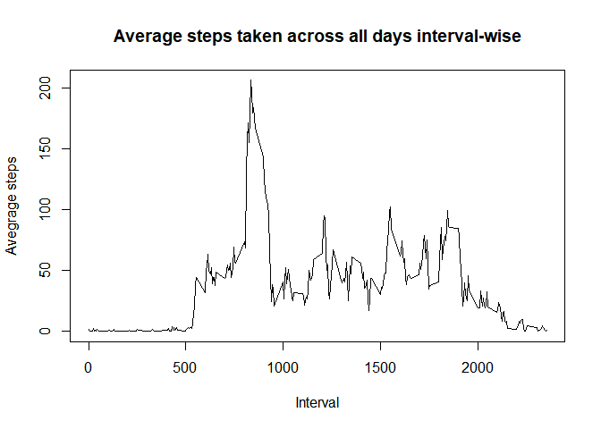
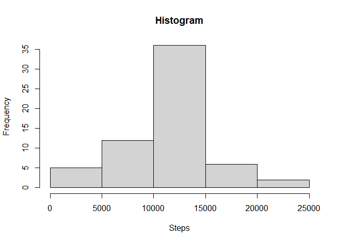
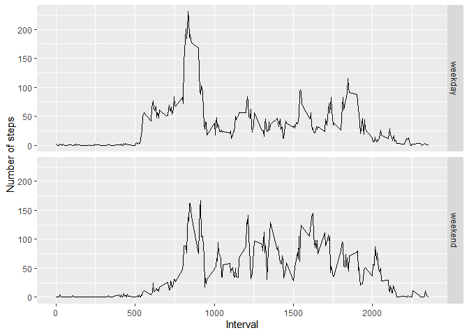

## Loading and Preprocessing the Data 
We are assuming that the data has been downloaded, unzipped and working directory is set to where the downloaded data is available. 

```r
activity = read.csv("activity.csv", na.strings = "NA")
activity$date = as.Date(activity$date)
```

## What is mean total number of steps taken per day?
Calculating the total number of steps per day

```r
totalsteps = aggregate(steps~date, activity, sum)
```

Histogram of the totalsteps per day: 

```r
hist(totalsteps$steps, xlab = "Steps", main = "Total no. of steps per day")
```

<!-- -->
Mean and median of the total number of steps: 

```r
meansteps = mean(totalsteps$steps, na.rm = TRUE)
mediansteps = median(totalsteps$steps, na.rm = TRUE)
print(paste("Mean number of steps: ", meansteps))
```

```
## [1] "Mean number of steps:  10766.1886792453"
```

```r
print(paste("Median number of steps: ", mediansteps))
```

```
## [1] "Median number of steps:  10765"
```

## What is the average daily activity pattern?
Time series plot showing the average number of steps taken per 5-minute interval.

```r
stepsinterval = aggregate(steps~interval, activity, mean)
## time series plot
plot(stepsinterval$interval, stepsinterval$steps, xlab = "Interval", ylab = "Avegrage steps", main = "Average steps taken across all days interval-wise", type = "l")
```

<!-- -->
The 5-minute interval across all days in the dataset containing maximum number of steps: 

```r
stepsinterval[which.max(stepsinterval$steps),1]
```

```
## [1] 835
```

## Imputing missing values

Total number of missing values in the dataset: 

```r
sum(is.na(activity$steps))
```

```
## [1] 2304
```

All missing values in the data set can be filled in with the mean number of steps in the 5-min intervals

```r
##Creating a new dataset 
activityNoNA = activity
##Replcement 
missingindices = which(is.na(activityNoNA$steps))
activityNoNA[missingindices,]$steps = stepsinterval$steps
##sum(is.na(activityNoNA))
```

Histogram of the total number of steps taken each day: 

```r
noNAtotalsteps = aggregate(steps~date, activityNoNA, sum)
hist(noNAtotalsteps$steps)
```

<!-- -->
The mean and the median of the total number of steps taken per day 

```r
noNAmeansteps = mean(noNAtotalsteps$steps, na.rm = TRUE)
noNAmediansteps = median(noNAtotalsteps$steps, na.rm = TRUE)
print(paste("Mean number of steps: ", noNAmeansteps))
```

```
## [1] "Mean number of steps:  10766.1886792453"
```

```r
print(paste("Median number of steps: ", noNAmediansteps))
```

```
## [1] "Median number of steps:  10766.1886792453"
```
These values do not differ much from the first part of the assignmnet. The mean remaines the same, however, the median seems to have increased slightly, by imputing the missing values with the stratergy above.

## Are there differences in activity patterns between weekdays and weekends?

Adding a column which denots if the day is a weekday or a weekend. This factor variable will help in plotting the required graph:

```r
day = weekdays(activityNoNA$date)
day = sub("Monday|Tuesday|Wednesday|Thursday|Friday","weekday", day)
day = sub("Saturday|Sunday","weekend", day)
day = factor(day)
activityNoNA = cbind(activityNoNA, day)
```
The time series plot of average number of steps taken in the 5-min interval: 

```r
daysteps = aggregate(steps~interval+day, activityNoNA, mean)
library(ggplot2)
g = ggplot(daysteps, aes(interval, steps))
g+geom_line()+ facet_grid(day~.)+ xlab("Interval")+ylab("Number of steps")
```

<!-- -->


END
